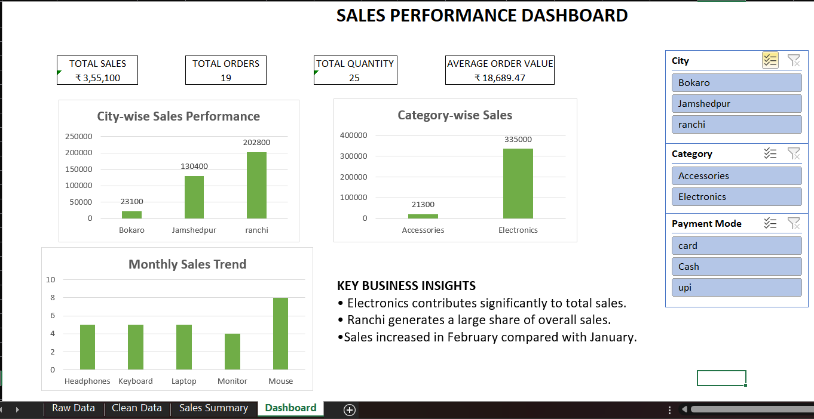

# 📊 Sales Data Cleaning & Dashboard

## 📌 Project Overview

This project demonstrates an end-to-end **Excel data cleaning, analysis, and dashboard creation workflow** using a sample sales dataset.

The objective was to transform raw and inconsistent sales data into a clean, structured dataset and create an interactive dashboard for quick business analysis.

## 🧹 Data Cleaning Performed

The raw dataset contained common data-quality issues that were cleaned using Microsoft Excel.

* Standardized customer names
* Removed unnecessary spaces using `TRIM`
* Standardized city names using `PROPER`
* Standardized payment modes using `UPPER`
* Handled missing customer information
* Identified and removed duplicate records
* Converted the dataset into a structured Excel Table
* Prepared clean data for analysis and reporting

## 📊 Dashboard Features

The interactive dashboard includes:

* **Total Sales**
* **Total Orders**
* **Total Quantity Sold**
* **Average Order Value**
* Sales analysis by city
* Category-wise sales analysis
* Monthly sales trend
* Interactive slicers for:

  * City
  * Category
  * Payment Mode

## 📈 Key KPIs

| KPI                 |      Value |
| ------------------- | ---------: |
| Total Sales         |   ₹355,100 |
| Total Orders        |         19 |
| Total Quantity      |         25 |
| Average Order Value | ₹18,689.47 |

## 🖼️ Dashboard Preview

## 🛠️ Tools & Techniques

* Microsoft Excel
* Excel Formulas
* Data Cleaning
* PivotTables
* PivotCharts
* Slicers
* Data Analysis
* Data Visualization
* Dashboard Development

## 💼 Skills Demonstrated

**Excel Data Cleaning | Data Analysis | Dashboard Creation | Data Visualization | Business Reporting**

## 📁 Project Files

* `Sales_Data_Cleaning_Sample.xlsx` — Complete Excel workbook containing raw data, cleaned data, analysis, and dashboard
* `Sales_Dashboard_Portfolio.png` — Dashboard preview
* `README.md` — Project documentation

## 🎯 Business Value

This project demonstrates how raw sales data can be transformed into a structured and interactive reporting solution that helps users quickly understand sales performance, product categories, locations, payment methods, and monthly trends.
